# The social and linguistic dynamics of an on-line community.

There is a theory in social science, that people adopt similar patterns of language use when they
interact. (See, for example, Gonzales et al.1) This assignment will investigate whether this concept
is evident for an online forum, where participants communicate with each other via conversations in
a thread. 

## Introduction

The purpose is to evaluate the data set given of a forum, to determine if people communicate with each other in a thread using similar language pattern. We would also like to investigate if the language used between users of the thread or forum changes over time.
From the data set, there was 32 columns and 20,000 rows of data consisting from year 2002 to 2011. The classes of the columns consist of integer, factor and numeric. 

## Goals

1. Investigate whether members who are communicating directly with each other (via threads) use similar language, which may be different to other members of the forum.

2. Investigate whether the language used changes over time. For example, does the proportion of language expressing optimism change?

## Data

1. Data is taken from a real online forum and consists of the metadata and linguistic analysis of 20,000 posts over the years 2002 to 2011. The linguistic analysis was conducted using Linguistic Inquiry and Word Count (LIWC), which assesses the prevalence of certain thoughts, feelings and
motivations by determining the proportion of key words in language. (see more at http://liwc.wpengine.com/wpcontent/uploads/2015/11/LIWC2015_LanguageManual.pdf)

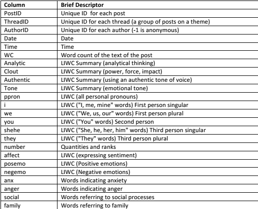
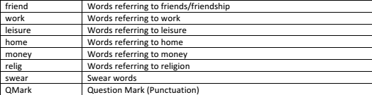

## Data Cleaning

1. We discovered that the data set consist of dirty data, which are anonymous users along with posts with zero word counts. As there are many anonymous users, we cannot differentiate if they are the same author or different authors, which means we would not be able to investigate the interaction of users properly. By removing the anonymous authors, we are left with 18,854 rows of data. 

2. Zero word count in a post would mean that nothing is posted to the thread which means that the other columns would be 0. This would not provide any valuable information to the investigation of this assignment. Removing all zero word count rows, would leave us with 18,808 rows of data.

3. Before any investigation begun, we checked to see if there were any identical post ID as the post ID should be unique and cannot have more than one of the same post ID. Having the same post ID would mean there is duplication of data and would not be useful. After investigating, there were no duplicates found.

4. From the columns “I”, “we”, “you”, “she/he”,” they”, we can see that they are under the same group which is the column “ppron” based on the LIWC 2015 Language Manual. The total sum of values for these columns add up to be the value of ppron. By looking at a few rows of data, some of these pronouns columns are zero. This may be because an author might only use one pronoun in a post, therefore the rest would be zero. Since these columns are under the column ppron, we can use ppron to compare with other non-pronoun columns as it is still a pronoun. Therefore, we’ve decided to remove these columns from the data set.

5. We have also decided to remove the “Number” column from the data set as it is not connected to any other columns based on the LIWC 2015 Language Manual. It only represents quantities and ranks such as second and thousand which does not tell us anything about the language used.
In the data set, it was found that the class of the “Date” column was in factor. We changed the class into date as it was more appropriate for a “Date” column. If we were to get the minimum date while it is in factor, it would return the smallest day, only considering of the day such as 01-05-02. While if in the class Date, the minimum would return the smallest date, considering the month and year such as 01-01-02.
After completing data cleaning on the data set, we are left with a total of 18,808 rows with 26 columns.

# Results

## Grouping
### Based on Thread ID

As this is a forum, each thread would be a topic in the forum, which means different thread would contain different topics. We can say that people would communicate on the same topic based on the thread itself. By grouping based on Thread ID, we are able to investigate the interactions between authors in a thread. From this, we can see that there are 260 unique Thread IDs in the data set. From the 260 unique Thread IDs, we take a sample of 3 Thread IDs which would be obtained randomly using R to avoid any sort of bias. The sample size of 3 would be a representation of the whole data and it is a manageable size as opposed to the whole data set. 

### Level of Interaction in a Thread

From the sample of 3, we would like to investigate the level of interaction between members in a thread and which days of the week is most active in a thread. For this investigation, we assume that users in a same thread would interact with one another and would not reply to themselves, meaning a reply would come from a different author. As each post ID is unique, we also assume that the number of post indicates the level of interaction, where the greater the number of post, the greater the interaction between authors. We believe that a thread would grow from the beginning until the middle and decreases at the end of the thread lifespan.

For this investigation, we would require the days of the week from the “Date” column. We created a new column for each thread containing the day of the week which the post is posted. With the use of library(beeswarm) we created a strip plot of the post ID’s and the day of weeks. This plot would show us the post IDs for each day of the week accumulated. 

From the plot, each dot represents the post ID which would tell us the number of post for the day. Since each post ID is unique, we assume that the closer the post ID is to each other, the closer the time interval between each post. We can see that each group of dots would mean that there is a discussion going on within that period. Since post ID always increases, we can determine which day of the week the thread has started and which has ended. As time goes by, we can see that the number of dots decreases until the final dot. Which tells us that from the beginning up till the middle, the number of post grows while from the middle till the end, the number of post stops growing. The day with the most number of dots indicates that the day is the most active of the week for that thread. 

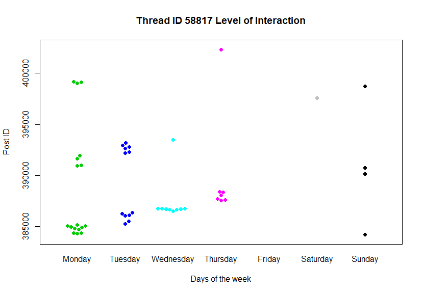
Figure 1 Beeswarm 1

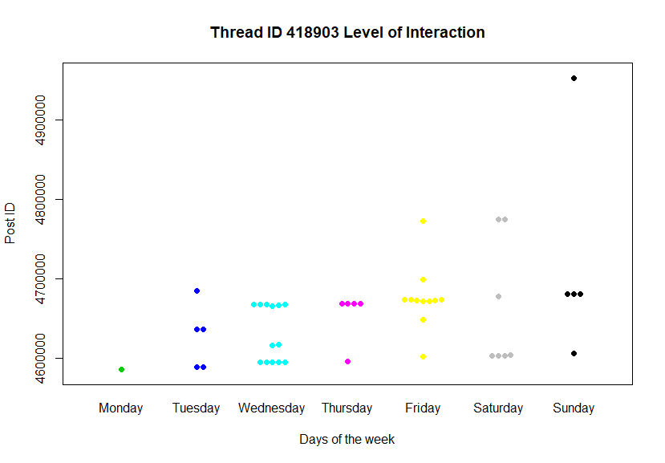
Figure 1 Beeswarm 2

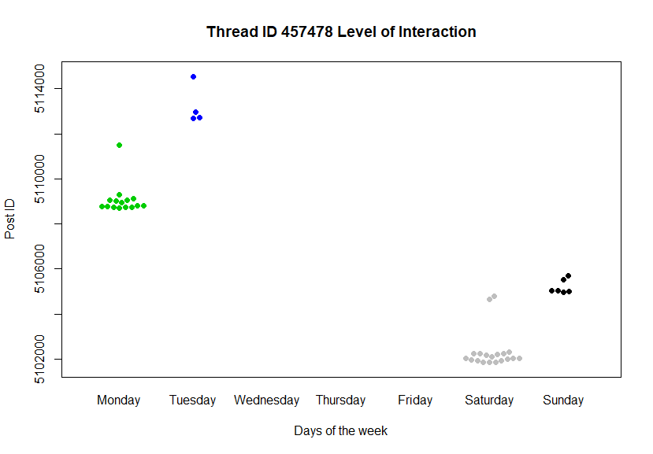
Figure 1 Beeswarm 3

### Personal Concerns in each thread

From our investigation above, we would like to further investigate which personal concerns weighs more on each individual thread. Based on the LIWC 2015 Language Manual we know that personal concerns include the column work, leisure, home, money and religion. We think that by doing this investigation, it will help us understand the trend of posts in each thread from the previous investigation. We used a bar chart to help visualise this investigation with the use of library plot_ly. The mean of each personal concerns for each thread is calculated, then grouped them in to the plot by the Thread ID. 
 
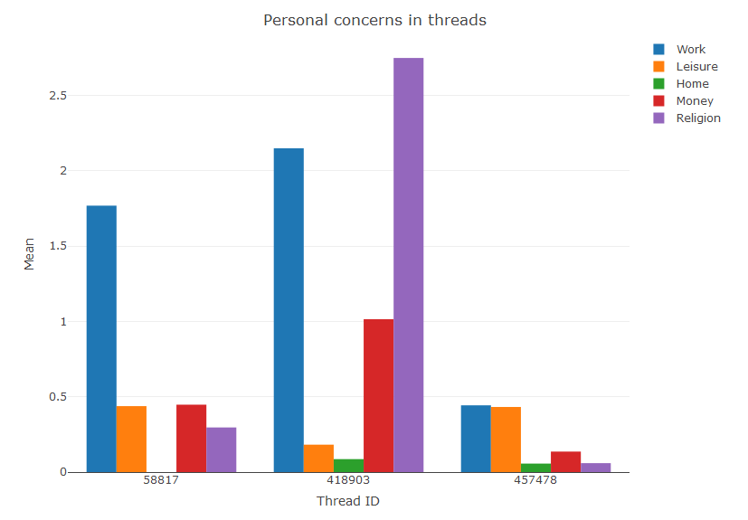
Figure 4 Bar chart

Based on Figure 1, the pattern of posts in the thread is most active on workdays and minimal on the weekends and non-existence on Fridays. We can assume that this is because the topic is work related as from this investigation we can see that “Work” is the highest among all the other personal concerns. This could be a discussion thread on their working environment. 

In Figure 2, the pattern in post is consistent from Tuesday to Sunday. From this investigation, “Religion” and “Work” are the highest personal concerns. We can assume that the pattern of posts in the thread is because of the topics in this thread which is work and religion related. The thread could be controversial about religion alongside with working, which causes the trend of post to be consistent.

In Figure 3, we see that it is only active on Saturday till Tuesday, and in this investigation the values are much lower than the other 2 threads. We can assume that this thread only lasted 4 days. Since from the bar chart, we see that work and leisure is the highest so we can also assume that this thread was created to discuss about these two topics at the same time. For example, the posts on Saturday and Sunday was to discuss about taking leave off work Monday and Tuesday for leisure. 

In conclusion, the topic of work seems to be the most popular in these three threads while the topic of home is always the least or non-existence. Some threads may have a combination of multiple topics on personal concerns which are related to each other in the thread.

### Analytical thinking of users in a thread

We would like to determine the differences of analytical thinking of each user in each thread. Our assumptions are that for a topic, users would have different type of thinking, which would mean that the analytical thinking for each user will differ from each other. To determine if our assumption is accurate, we first find the mean of analytic for each user as there can be more than one post by a same user. By using a pie chart, we plot the mean of each author’s analytic thinking score for each of the sample Thread ID. The pie chart would be generated with the use of library(plotly).

Looking at the 3 pie charts of the sample Thread IDs, we can see that most of the users in each Thread have a close range in analytical thinking while only a minority of users differ from the majority. Thus, it can be said that users in each Thread ID have a similar analytical thinking. This could be because this may be a discussion forum and the majority have an agreement on the topic while the minority disagrees with the topic. Making the majority to have similar values in analytic while the minority have different values compared to the majority.
  
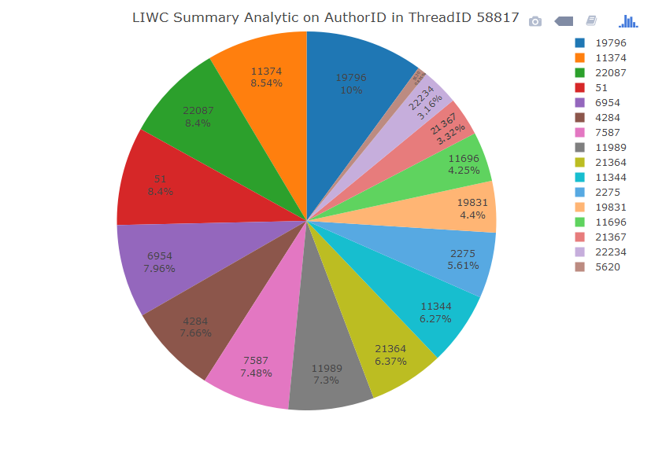
Figure 5 Pie Chart 1 						

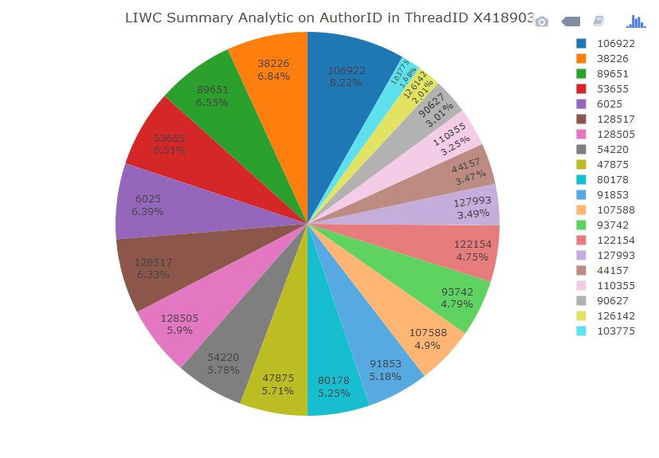
Figure 6 Pie Chart 2

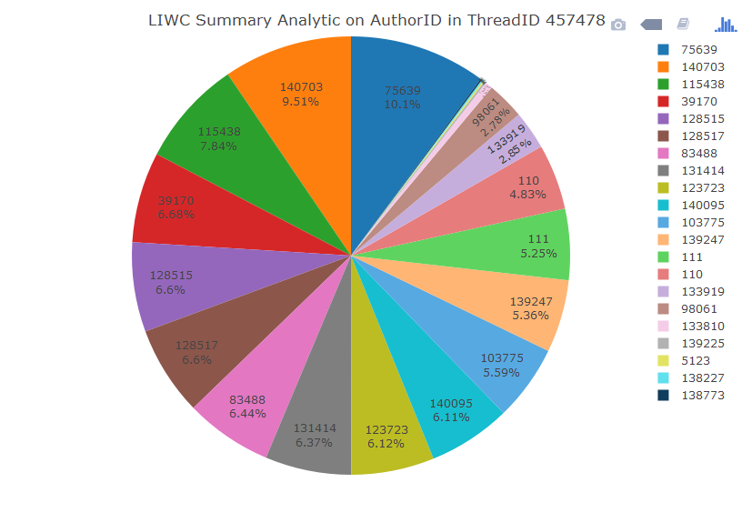
Figure 7 Pie Chart 3

### Based on Author ID

Since different threads has different topics, the tone of a person would vary based on the topics. We would like to see if an author uses a different tone throughout the forum. Therefore, we’ve decided on using tone as a measurement in this investigation to determine if a person has a similar or different style of speaking in different threads. 
    
We first get a sample of 10 random unique authors from the data set and going through these 10 authors we decided to pick the top 3 authors with the most posts, as some authors from the random sample may only consists of only 1 or 2 posts which would not be useful in this investigation. By using a violin plot we first have to find the mean of tone for each unique Thread ID as the author may have multiple post in one Thread ID. After getting the mean of tone for each Thread ID for all the 3 authors, we then combine them into a data frame. The violin plot would be generated with the use of library(ggplot2) and the colour used is from library(wesanderson).

From the results, we can see that each author does not have a similar tone throughout their post in different Threads. Each dot represents the mean from each thread for that author. As shown in the plot, each author has a wide range of tone throughout their posts in the forum. Although some dots are at the same mean of tone, we assume that the threads have a similar topic with each other. Therefore, the dots are together in a line. We can also see that some authors have a wider range of mean of tone, this may be because some authors have posted in more threads which leads to a variety of topics. 

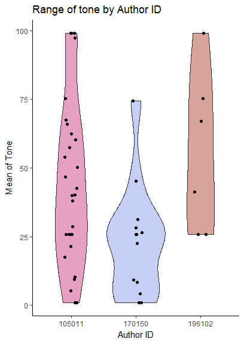
Figure 8 Violin Plot

## General Trend of Data Set
### Positive and Negative Emotion

From the data set, we would like to see the general trend of positive and negative emotions throughout the forum because we want to determine if the positive and negative emotions in user’s posts changes over time. The reason we choose positive and negative emotions is because we think that they affect what a user writes, how they write it and how much they write in a post.  For example, a user who is angry may use inappropriate words in the sentence, use capital letters to express his anger, or write more in a post.  Since the data set only consists of data from the year 2002 to 2011 we can only observe the trend from this range. 

We used an R library called dygraph to plot a line chart of mean of positive and negative emotions over the years. Plotting the graph, we first calculate the mean of positive and negative emotions of the whole data set by year, as we are not certain that the number of post for each year are similar and mean will return the average. If sum was used, the outcome would be bias to the year with the most post. 
From the graph, it can be seen that from 2002 to 2003, positive emotion decreases while negative emotion increase. However, for the other years, positive emotion is always higher than negative emotions, although it is not always in the increasing trend. From here, we can conclude that the overall emotions of users in this thread is positive. 

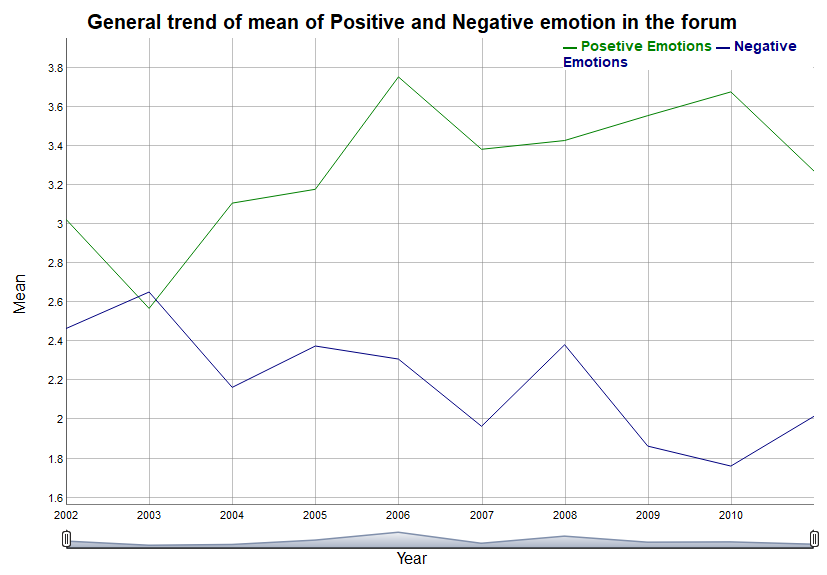
Figure 9 Time series 1

### Number of post per Year

We would like to determine the trend of posts in the forum as years goes by because we want to investigate the activeness of the forum. The forum is active if it always has a steady amount of posts made yearly and we would like to check if this forum is active or not. 

Based on the result, from the year 2002 to 2003, there is a decrease in number of posts by around 100 posts and from year 2003 to 2006, there is a huge increase in number of posts made, especially from year 2004 to 2005 where the difference in post from 2003 to 2004 and 2004 to 2005 is almost 3000 number of post. This could be because there is an increase in number of users in the forum. However, from the year 2006 there is a steady decrease in the number of post and a slight increase after the year 2010. This may be because of non-active users who only posts a few times in the entire forum.
 
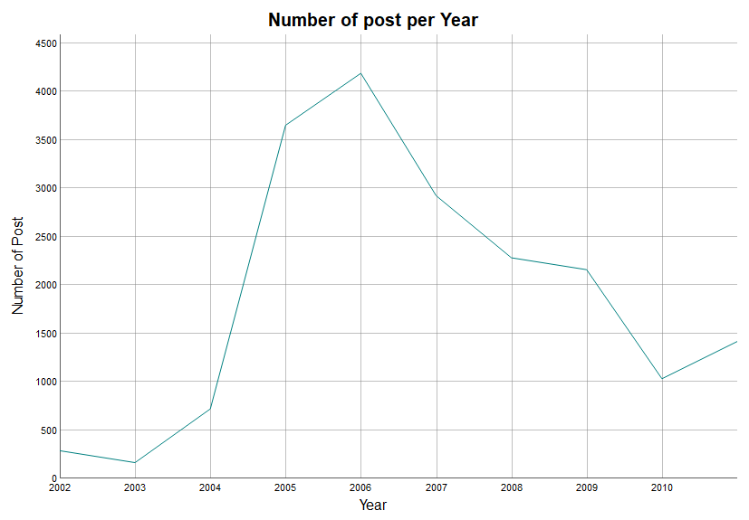
Figure 10 Time series 2

## Regression

Next, we would like to determine if positive and negative emotions have an effect on number of words in a post. More specifically, we would like to investigate our observation that people who have negative emotion tends to write more than those with positive emotion. To do this, we decided to do a regression of word count on positive and negative emotions to determine their relationship. 
We are going to use the whole data set for this regression because there is little information found from individual threads for positive and negative emotions. 

From the regression, it was found that positive emotion is the better predictor for word count because its p-value is smaller. We can also see that a one unit increase in positive emotion will make the word count decrease by 3.0965 while a one unit increase in negative emotion will make the word count increase by 0.2854. Although from the result negative emotion does have a positive relation on word count, there really isn’t any significant difference as the increase in word count is only by 0.2854 which is not even close to 1 word. As for the positive emotion, the decrease in word count is greater than 1 word so there is a significant difference.

As it is normal for users to be angry, we think that if a user is angry, they can also swear. With so, we think that by swearing and having anger, it would increase their clout. Since clout is the use of power, force and impact, we decided that clout is the most suitable to measure the impact of a post on anger and swear. 

By doing regression, we can see that anger and swear is a strong predictor of clout because their p-value is less than 0.001. From our observation, we can see that one unit increase in anger will increase clout by 0.69842 and one unit increase in swear will decrease clout by 2.11395. However, we can see that our initial opinion was incorrect as by swearing, it does not increase clout but instead decreases clout, while the opinion that having anger increase clout is correct.

Since anger has a positive effect on clout, we would like to investigate further to determine the relationship of anger and social processes, if there is any. The reason we choose social processes is because human relationship is complex and people tend to rant about their issues regarding their social life on the internet. The social processes given in the data set are family and friends. We performed a regression of anger on family and friends.

From the result, family is the better predictor for anger as its p-value is less than 0.001 while friend has a p-value of more than 0.001. From the estimates, both family and friend has negative effect on anger. A one unit increase in family will decrease anger by 0.035981 while a one unit increase in friend will decrease anger by 0.005255. However, we can see that the value of the estimate is very small, which are 0.005 and 0.036 that it is hard to conclude that both family and friend have a relationship with anger.

Continuing from above, now we would like to determine the relationship of positive emotion and social processes as we have seen that we could not conclude if the social columns does have a relationship with negative emotion which is anger. Therefore, we perform another regression of positive emotion on social processes. 

The result of the regression shows us that both social processes are good predictors of positive emotion as their p-values are less than 0.001. We can see that one unit increase in family decreases the positive emotions by 0.09453, while one unit increase in friend increases the positive emotions by 0.30368. By comparing the results of both regression, positive emotion and anger, we can see that family and friends have more effect on positive emotion rather than on anger.

## Conclusion

In conclusion, each thread consists of topics specific to personal concerns where users would interact with each other depending on the topic of the thread. We can also say that users in the same thread have a similar style of analytical thinking. Each user in the forum would have a wide range of tone used in different topic depending on how many threads they are a part of. 

Over the years, the positive emotions on the forum is greater than the negative emotions, telling us that the users on the forum has a positive mindset most of the time. The number of posts on the forum varies over time which we think that it could be due to non-active users compared to the number of active users on the forum.